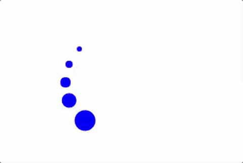
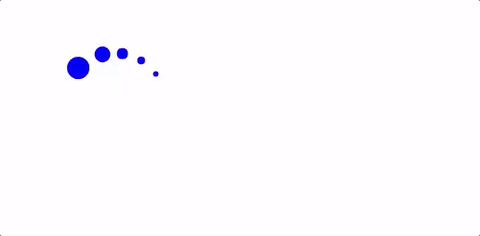

# Loopy Maze

Loopy Maze is a desktop browser game where the player must navigate through mazes without colliding into walls...while spinning nonstop. The game has an object-oriented Javascript structure, renders the maze using HTML5 canvas, and binds keys to events using the Mousetrap library.

This game is inspired by the iOS app Ball Maze.

[play here](https://sisiyao.github.io/LoopyMaze)


## Gameplay

The goal is to finish all levels of the maze without hitting any walls. Here's the catch: the player spins continuously in the counter-clockwise direction and the only way to move forward is to tap the space bar. Tapping the space bar repeatedly will move the player forward in a straight line. Holding the the space bar down will cause the player to spin the other way.

## Implementation

### Player Movement

The player object consists of three distinct parts that are handled in separate methods: the orbit, the head, and the tail.



While the orbit is never physically rendered, the head and the tail are rendered as points traveling along this invisible orbit. To simulate the orbital movement, I move the head a couple degrees along the circle in counter-clockwise fashion each time requestAnimationFrame renders. The tail is simply a recent history of where the head has been, stored in an array. See the following method for how I implement the rotation:

```JavaScript
rotate () {
  if (this.direction === 'clockwise') {
    this.angle = (this.angle === 2 * Math.PI || this.angle === 0)
      ? (2 * Math.PI) / 80
      : this.angle + (2 * Math.PI) / 80;
  } else {
    this.angle = (this.angle === 2 * Math.PI || this.angle === 0)
      ? (2 * Math.PI) - ((2 * Math.PI) / 80)
      : this.angle - (2 * Math.PI) / 80;
  }

  this.headCenter = this.pointOnOrbit(this.angle, this.center, this.radius);
  this.tail.pop();
  this.tail.unshift(this.headCenter);
}
```

By default, the player object spins counter-clockwise in a static orbit. To make the player move forward or switch spinning directions, I bound a key event to a method that simply changes the center of the circle and the direction of spin.



```JavaScript
turnCounterClockwise () {
  this.direction = 'counter-clockwise';
  this.switchAngles();
  this.calculateCenter();
}

switchAngles () {
  this.angle = (this.angle + Math.PI) % (2 * Math.PI);
}

calculateCenter () {
  this.center = [this.headCenter[0] - this.radius * Math.cos(this.angle),
    this.headCenter[1] - this.radius * Math.sin(this.angle)];
}
```

### 2D Scrolling Camera View


### Other Features

Other features of this game include:
- [ ] Maze rending with requestAnimationFrame
- [ ] Wall collisions
- [ ] Multiple levels of increasing difficulty. Includes seamless transition across levels using event listeners

## Future Improvements

Ideas I have for future development include:

- [ ] Adding moving obstacles for the player to avoid
- [ ] Adding checkpoints along the maze. If a player dies, it would regenerate at the closest checkpoint
- [ ] Adding a maze generator algorithm for future levels
